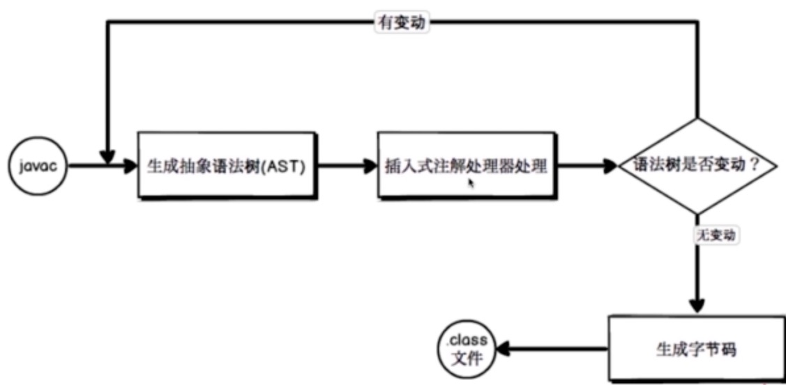
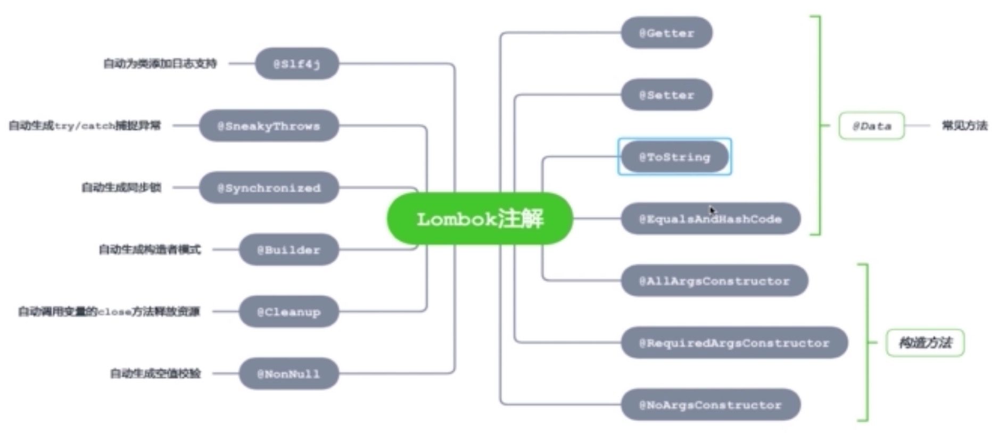
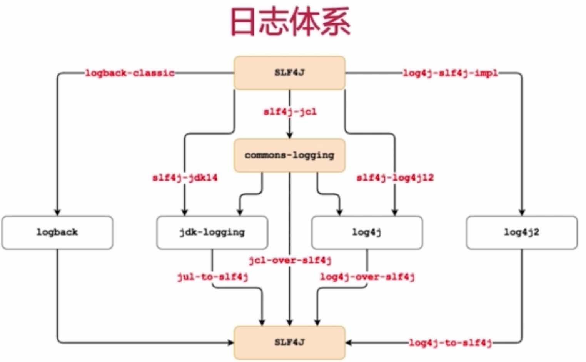

## 实用工具

### 1、Lombok简介
##### Project Lombok 实一个Java库，可以自动插入编辑器并构建工具，

### 2、Lombok实现原理
#### (1)、注解的两种解析方式
* 运行时解析 
###### 比如Spring中的AOP切面，这些注解都是在程序运行的时候，通过反射来获取这些注解值
* 编译时解析

#### (2)、编译时解析的两种机制
* Annotation Processing Tool (注解处理器) -- JDK1.8被移除了
* Pluggable Annotation Processing API （JSR269插入式注解处理器）
###### Lombok是工作在编译时期，利用了一个注解处理器，将我们自己写的注解，解析之后会为我们生成一些代码

#### (3)、流程图

#### (4)、Lombok常用注解

### 3、Lombok的优点
* 通过注解自动生成样板代码，提高开发效率
* 代码简洁，只关注相关属性
* 新增属性之后，无需刻意修改方法

### 4、Lombok的缺点
* 降低了源代码的可读性和完整性
* 加大对问题排查的难度
* 需要IDE相关插件的支持

### 5、Lombok注解
* @Slf4j 注解 : 简化日志引入方式
* @Builder 注解 : 简化对象创建过程
* @Singular 注解 : 配合@Builder 注解，简化集合类型操作

#### (1)、日志体系

### 6、@Builder
##### 作用：将对象的创建和对象的使用完全分离开来，对象的创建只能用builder()方法来进行创建，创建完之后对象不可变，只能对对象进行使用

## 检查工具
### 1、静态代码分析
##### 静态代码分析是指无需运行被测代码，仅通过分析或检查源程序的语法、结构、过程、接口等来检查程序的正确性，找出代码隐藏的错误和缺陷，如参数不匹配，有歧义的嵌套语句，错误的递归，非法计算，可能出现的空指针引用等等

#### (1)、主流Java静态代码分析工具
* CheckStyle
* FindBugs
* PMD

##### ①、CheckStyle 是 SourceForge 的开源项目。通过检查对代码编码格式，命名约定，Javadoc，类设计等方面进行代码规范和风格的检查，从而有效约束开发人员更好地遵循代码编写规范
##### ②、FindBugs 是由马里兰大学提供的一款开源Java静态代码分析工具。FindBugs通过检查类文件或JAR文件，将字节码与一组缺陷模式进行对比从而发现代码缺陷规范，完成静态代码分析
##### ③、PMD 是由 DARPA 在 SourceForge 上发布的开源Java代码静态分析工具。PMD 通过其内置的编码规则对Java代码进行静态检查，主要包括对潜在的bug，未使用的代码，重复的代码。循环体创建新对象等问题的检验

#### (2)、三种方式的特定
* Checkstyle : 检查源文件，主要关注格式
* FindBugs : 基于Bug Patterns概念，检查.class文件中的潜在的Bug
* PMD : 基于静态规则集，检查源文件中的潜在问题

### 2、IDEA相关插件及使用方式
* QAPlug - Checkstyle
* QAPlug - FindBugs
* QAPlug - PMD

### 3、SonarQube

##### SonarQube 是一个用于代码质量管理的开源平台，用于管理源代码的质量。支持7个维度，二十几种编程语言。
##### 通过自动代码审查工具，可检测代码中的错误，漏洞和代码异味。可以与您现有的工作流程集成，以实现夸项目分支合请求的连续代码检查

* 通过插件机制，可以集成不同测试/分析/集成工具
* 通过量化的方式度量代码质量的变化，从而进行代码质量管理
* 提供接口支持，可以方便在持续集成中使用

