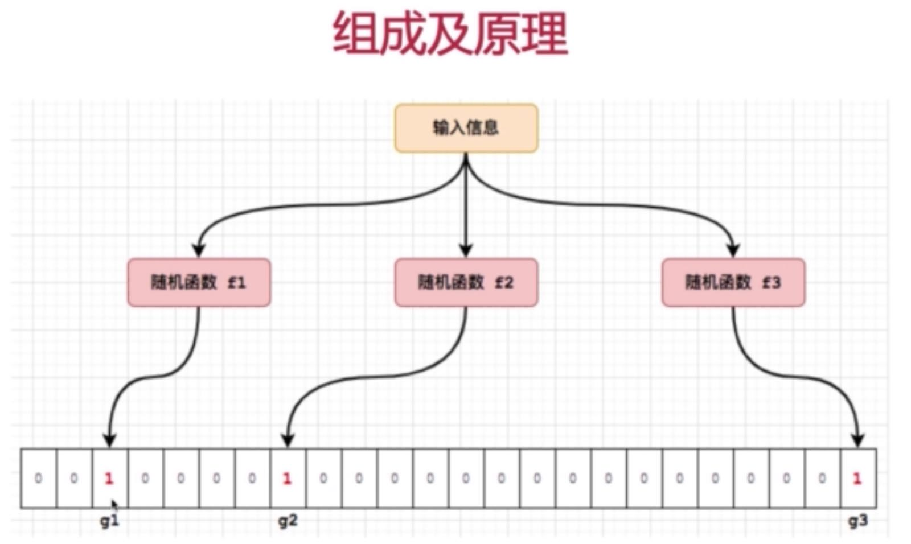

## 工具集

### 1、Google Guava 工具集简介

##### Guava工程包含了若干被Google的Java项目广泛依赖的核心库， 例如:集合、缓存、原生类型支持、并发库、通用注解、字符串处理、I/O等等。
##### 所有这些工具每天都在被Google的工程师应用在产品服务中。

#### (1)、使用和避免null
* “Null 真糟糕” --- Doug Lea (JUC并发包的创始人)
* 大多数情况下，使用null表明的是某种缺失情况

##### Guava引入Optional<T> 表明可能为null的T类型引用。Optional实例可能包含非null的引用(引用存在)，也可能什么也不包括(引用缺失)。
##### 正是受到Guava的启发，Java8将Optional类做为一个锌特性引入进Java8的类库。

### 2、实战案例 : Java8新特性Optional
* 实战 : Java8 的Optional锌特性如何使用

### 2、不可变集合

##### 创建对象的不可变拷贝是一项很好的防御性编程技巧
##### Guava为所有JDK标准集合类型和Guava新集合类型都提供了简单易用的不可变版本

#### (1)、不可变对象的优点
* 当对象被不可信的库调用时，不可变形式是安全的
* 不可变对象被多个线程调用是，不存在竞态条件问题
* 不可变集合不需要考虑变化，因此可以节省时间和空间
* 不可变对象因为有固定不变，可以作为常量来安全使用

#### (2)、JDK提供的unmodifiableXXX方法
* 笨重而且累赘
* 不安全
* 低效

#### (3)、不可变集合的三种创建方式
* copyOf方法 : ImmutableSet.copyOf(set)
* of方法 : ImmutableSet.of("a", "b", "c");
* Builder工具 : ImmutableSet.builder().build()

### 3、新集合类型

##### Guava引入了很多JDK没有的，但明显有用的新集合类型。这些新类型是为了和JDK集合框架共存，而没有往JDK集合抽象中硬塞其他概念。

#### (1)、Multiset (用两种不同的视角去审视它)

###### Multiset 中元素可以是重复的，但是元素也是无序的

1. 没有元素顺序限制的ArrayList(E)
> add(E) : 添加单个给定元素

> iterator() : 返回一个迭代器，包含Multiset所有元素(包含重复元素)

> size() : 返回所有元素的总个数(包含重复元素)

2. Map<E, Integer>, 键为元素，值为计数
> count(Object) : 返回给定元素的计数

> entrySet()  : 返回Set<Multiset.Entry<E>>, 和Map的entrySet类似

> elementSet() : 返回所有不重复元素的Set<E>, 和Map的keySet类似

#### (2)、Multiset和Map的区别

1. 元素计数只能是正数
2. multiset.size()返回集合大小
3. multiset.iterator()会迭代重复的元素
4. multiset支持直接设置元素的计数
5. 没有的元素，multiset.count(E)为0

#### (4)、多种Multiset的实现
1. HashMultiset
2. TreeMultiset
3. LinkedHashMultiset
4. ConcurrentHashMulitset
5. ImmutableMultiset

#### (5)、实战案例 : Multiset使用
1. 实战 : 使用Multiset集合类，实现统计一篇文章中文字出现次数功能

### 4、IO流
#### (1)、对字节流/字符流提供的工具方法
* ByteStreams : 提供对InputStream/OutputStream的操作
* CharStreams : 提供对Reader/Write的操作

#### (2)、Guava对IO进行了 源(Source) 和 汇(Sink) 的抽象
* 源是可读的 : ByteSourse/CharSourse
* 汇是可写的 : ByteSink / CharSink

#### (3)、实战 : 利用Guava提供的相关工具类，实现对文件的常见操作

### 5、布隆过滤器
>       在软件开发过程中，经常要判断一个元素是否在一个集合中。
>       如何实现检查一个单词是否拼写正确？
>                                        -- 摘自 <数学之美>

#### (1)、常见的实现方式

- 方法一 ：使用一个集合对象，缓存字典中所有单词。判断被检查的单词是否存在于集合中。
- 方法二 ：使用数据库，将字典中所有单词做成数据记录。使用被检查的单词来索引数据

#### (2)、常见实现的缺点
- 字典中单词量大时，消耗很多系统资源
- 检索性能不好，容易出现瓶颈
- 需要存储大量无用数据，容易造成数据泄露风险

#### (4)、布隆过滤器
###### 布隆过滤器(Bloom Filter)是由伯顿.布隆(Burton Bloom)于1970年提出的。
##### 它实际上是由一个很长的二进制向量和一系列随机映射函数构成。

#### (5)、组成及原理

#### (6)、实战案例 : Guava单机版布隆过滤器

#### (7)、布隆过滤器优点
- 不需要存储数据本身，节省资源，并且可以保证信息安全。
- 时间效率高，插入和查找的时间啊in复杂度均为O(k), k为hash函数的个数
- Hash函数之间相互独立，可以在硬件指令层面并行计算

#### (8)、布隆过滤器缺点
- 存在假阳性概率，不适合用于任何要求100%准确率的场景
- 只能插入和查询元素，不能删除元素。主要是不能判断要删除的元素是否一定在集合中。

#### (9)、布隆过滤器的应用场景
- 字处理软件中，检车一旦单词是否拼写正确
- 网络爬虫里，一个网址是否被访问过
- 垃圾邮件的过滤功能
- Hbase中根据RowKey查询数据时