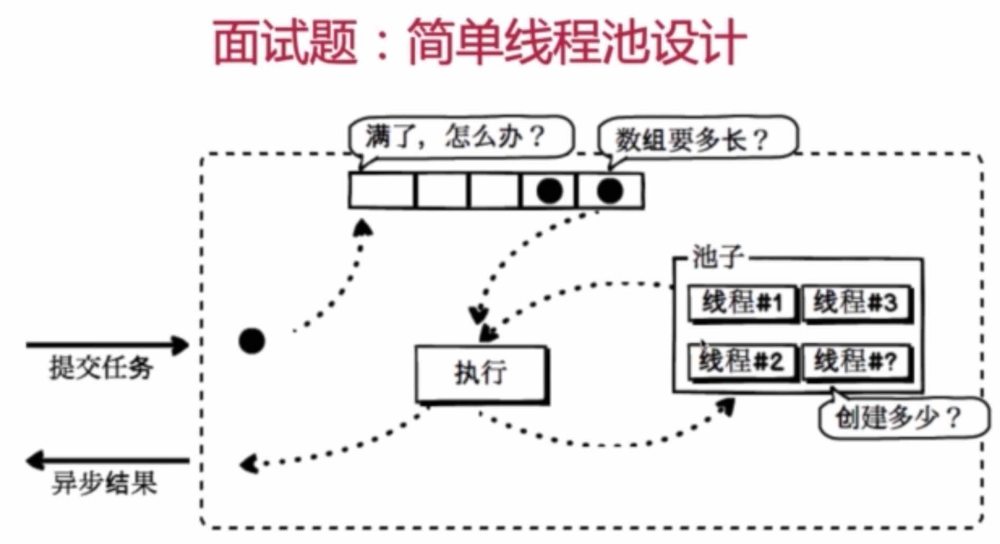
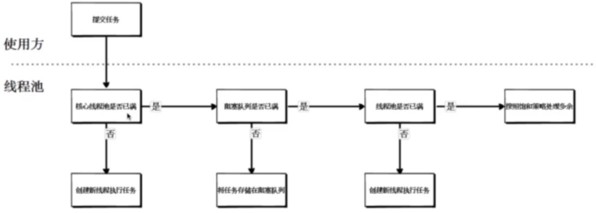
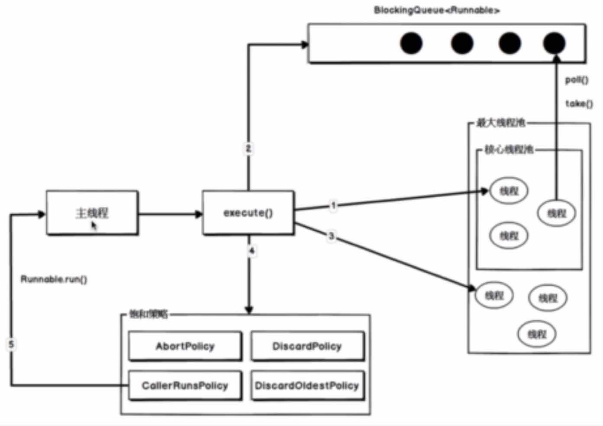
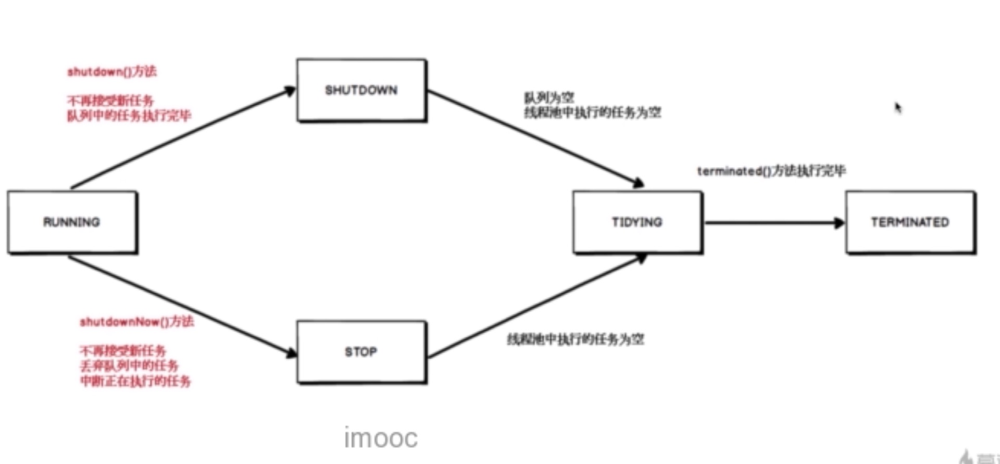

## 线程池

### 1、线程池概述

#### (1)、什么是线程池？

###### 线程池顾名思义就是事先创建若干个可执行的线程放入一个池(容器)中，需要的时候从池中获取线程不用自行创建，使用完毕不需要销毁线程而是放回池中，从而减少创建和销毁线程对象的开销

#### (2)、线程池带来的好处
###### 其实不光线程池，任何的池化技术都是能够达到降低资源的消耗，

* 降低资源消耗
###### 减少了线程创建和销毁所带来的资源的消耗，数据库连接池本身也是通过池化技术来降低建立连接和释放连接所带来的资源的消耗

* 提高响应速度
* 提高线程的可管理性

### 2、面试题：简单线程池设计


### 3、线程池的核心参数
```java
    class ThreadPoolExecutor{
        /**
        * 线程池核心参数
        * @param corePoolSize       核心线程数量
        * @param maximumPoolSize    最大线程数量
        * @param keepAliveTime      线程空闲后的存货时间
        * @param unit               时间单位
        * @param workQueue          用于存放任务的阻塞队列
        * @param threadFactory      线程工厂类
        * @param handler            当队列和最大线程池都满了之后的饱和策略
        */
        public ThreadPoolExecutor(int corePoolSize,
                                      int maximumPoolSize,
                                      long keepAliveTime,
                                      TimeUnit unit,
                                      BlockingQueue<Runnable> workQueue,
                                      ThreadFactory threadFactory,
                                      RejectedExecutionHandler handler) {}
    }
```

#### (1)、线程池的处理流程


### 4、线程池可选择的阻塞队列
> 阻塞队列就是一个支持两个附加操作的队列，这俩个附加操作是指：阻塞的插入和移除的方法

> > 阻塞的插入 : 当队列满时，队列会阻塞插入元素的线程，直到队列不满

> > 移除 : 如果队列为空时，获取元素的线程会等待队列变为非空，即有数据了

* 无界队列(这个队列无限长，可以一直往里边添加元素)
* 有界队列
* 同步移交队列(不存入元素的元素队列，每个插入的操作必须等到另一个线程去调用移除操作，才能成功，否则插入操作一直处于阻塞状态)


### 5、线程池可选择的饱和策略 (ThreadPoolExecutor 线程池类中四个内部类，对应以下四个策略)
* AbortPolicy终止策略(默认)
* DiscardPolicy抛弃策略
* DiscardOldestPolicy抛弃旧任务策略
* CallerRunsPolicy调用者运行策略 (这个策略做的就是让调用方自己执行runnble的run方法)
###### 这个饱和策略就相当于是当当前线程达到了最大线程数并且阻塞队列也满了，那么用户如果选择了这个饱和策略，他提交的任务就还是由他自己来执行，本身就不是一个异步的概念了

### 6、线程池执行的示意图


### 7、常用线程池

#### (1)、常用线程池之newCachedThreadPool
```java
    class A {
        /**
        * 线程数量无限线程池
        * @return 
        */
        public static ExecutorService newCachedThreadPool() {
                return new ThreadPoolExecutor(0, Integer.MAX_VALUE,
                                              60L, TimeUnit.SECONDS,
                                              // 同步移交的阻塞队列
                                              new SynchronousQueue<Runnable>());
        }
    }
```

#### (2)、常用线程池之newFixedThreadPool
```java
    class A{
        /**
        * 线程数量固定线程池
        * @param nThreads
        * @return 
        */
        public static ExecutorService newFixedThreadPool(int nThreads) {
                return new ThreadPoolExecutor(nThreads, nThreads,
                                              0L, TimeUnit.MILLISECONDS,
                                              // 无界阻塞队列
                                              new LinkedBlockingQueue<Runnable>());
            }
    }
```

#### (3)、常用线程之newSingleThreadExecutor
```java
    class A {
        /**
        * 单一线程线程池
        * @return 
        */
        public static ExecutorService newSingleThreadExecutor() {
                return new FinalizableDelegatedExecutorService
                    (new ThreadPoolExecutor(1, 1,
                                            0L, TimeUnit.MILLISECONDS,
                                            // 无界阻塞队列
                                            new LinkedBlockingQueue<Runnable>()));
            }
    }
```

### 8、线程池的状态
