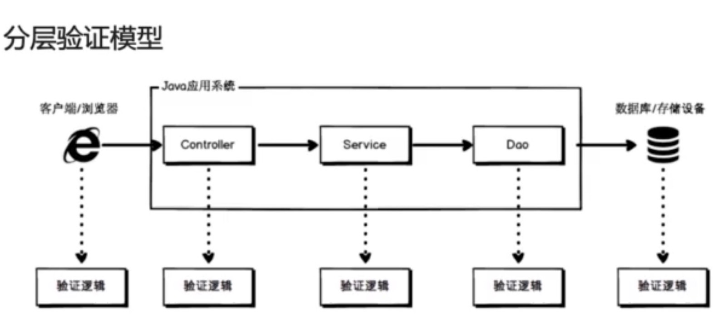
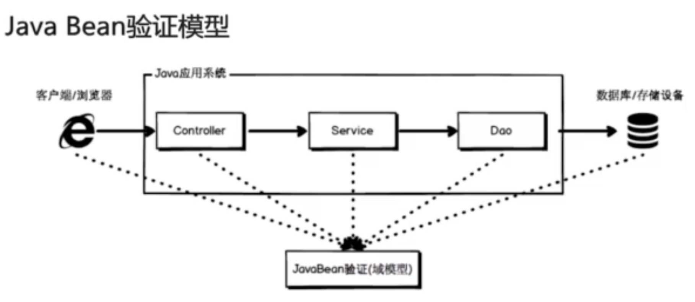

## 验证框架学习

##### 了解JSR规范

### 1、分层验证与JavaBean验证

#### (1)、分成验证模型

#### (2)、Java Bean验证模型

#### (3)、Bean Validation简介

##### Bean Validation 为 JavaBean 验证定义了相应的元数据模型和API

### 2、规范编程的常见名词

#### (1)、JCP、JSR简介

##### JCP (Java Community Process)成立于1998年，是使有兴趣的各方参与定义Java的特性和未来版本的正式过程。

##### JSR 使用JSR (Java规范请求，Java Specification Requests)作为正式规范文档，描述被提议加入到Java体系中的规范和技术

#### (2)、有关数据校验的JSR有：JSR303、JSR349、JSR380

* JSR303 -- Bean Validation 1.0，是Java用于对象验证的第一个版本， 2009发布，JAVAEE 1.6
* JSR349 -- Bean Validation 1.1，第二个版本，2013发布，JAVAEE 1.7
* JSR380 -- Bean Validation 2.0, 2017 发布，JAVAEE 8 ，支持容器类型级别验证，添加新的约束注解

### 3、校验之BV、HV、SV

#### (1)、Bean Validation 于 Hibernate Validator

###### Bean Validation 的各个版本仅仅是为框架定义了规范，并没有给出具体的实现
###### Hibernate Validator就是对规范的具体实现
###### Hibernate Validator 框架虽然也是 ORM框架 Hibernate 开发团队开发的，但是俩者没哟任何关系，是针对不同功能开发的

* Bean Validation 1.0 参考实现 : Hibernate Validator 4.3.1.Final
* Bean Validation 1.1 参考实现 : Hibernate Validator 5.1.1.Final
* Bean Validation 2.0 参考实现 : Hibernate Validator 6.0.1.Final

#### (2)、Hibernate Validator 与 Spring Validation 

##### Spring Validation 在 Hibernate Validator的基础上，对其进行了二次封装，以满足在Spring环境中更简单、高效的对数据进行验证

### 4、常用约束注解

#### (1)、常用约束注解
* 空值校验类 : @Null, @NotNull, @NotEmpty, @NotBlank等
###### @NotEmpty 会将左右的空字符去除掉，来判断这个字符是否为空
###### @NotBlank 会直接判断这个字符串是否为空
* 范围校验类 : @Min， @Size， @Digits， @Future， @Negative等

* 其他校验类 : @Email, @URL, @AssertTrue, @Pattern等